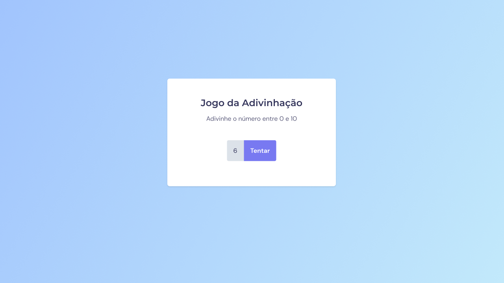
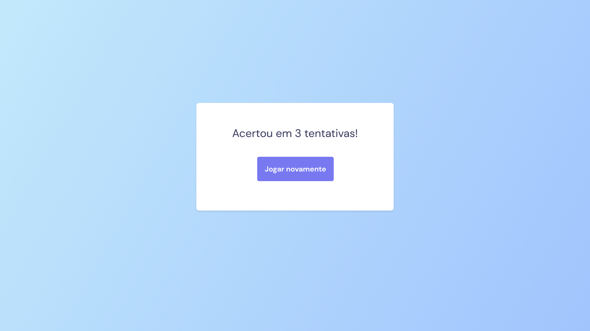

<h1 align="center"> stage 05 Desafio 01  Jogo da Adivinhação </h1>

  <a href="#-tecnologias">Tecnologias</a>&nbsp;&nbsp;&nbsp;|&nbsp;&nbsp;&nbsp;
  <a href="#-projeto">Projeto</a>&nbsp;&nbsp;&nbsp;|&nbsp;&nbsp;&nbsp;
  <a href="#-layout">Layout</a>&nbsp;&nbsp;&nbsp;|&nbsp;&nbsp;&nbsp;
  <a href="#memo-licença">Licença</a>

  

 
  

    

## 🚀 Tecnologias

Esse projeto foi desenvolvido com as seguintes tecnologias:

- HTML 
- CSS
- Github
- Figma
- JavaScript

## 💻 Projeto

  O site do jogo da adivinhação é uma aplicação interativa que desafia os jogadores a adivinharem um número secreto entre 1 e 10. O objetivo do jogo é acertar o número correto com o menor número possível de tentativas.

<h2> Conceitos usados na aplicação</h2>

  <ul>
  <li>Estilização de fontes e textos</li>
  <li>Unidade de Medida Flexível</li>
  <li>Variáveis</li>
  <li>Input e Button</li>
  <li>Introdução a DOM </li>
  <li>Manipulaçao da DOM</li>
  <li>Aplicação da lógica</li>
  <li>Refatoração</li>

  </ul>
      
 

- [Visite o projeto online](https://www.figma.com/file/5bxl7Jtfe0QBRvHZmihsEZ/Jogo-Adivinha%C3%A7%C3%A3o-(Copy)?type=design&mode=design)

 

## 🔖 Layout

Você pode visualizar o layout do projeto através [DESSE LINK](https://www.figma.com/file/5bxl7Jtfe0QBRvHZmihsEZ/Jogo-Adivinha%C3%A7%C3%A3o-(Copy)?type=design&mode=design). É necessário ter conta no [Figma](https://figma.com) para acessá-lo. 

  

## :memo: Licença

Esse projeto está sob a licença MIT.

---

Feito com ♥ by Iara Marques :wave: [Participe da comunidade da RocketSeat!](https://discord.gg/rocketseat)